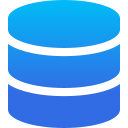

  <h1>Welcome to Axiom</h1>

  <a href="/usage/ingest" class="overview-item" title="Ingest">
    
    

      <h4>Ingesting Data</h4>
      
Get data into Axiom

    

  </a>
  <a href="/usage/analyze" class="overview-item" title="Analyze">
    
    

      <h4>Analyzing Data</h4>
      
Gain insights from your data

    

  </a>
  <a href="/usage/stream" class="overview-item" title="Stream">
    
    

      <h4>Stream Data</h4>
      
Inspect streams of data live

    

  </a>
  <a href="/usage/alerts" class="overview-item" title="Monitor">
    
    

      <h4>Monitor Data</h4>
      
Alert in real-time

    

  </a>
  <a href="/usage/dashboards" class="overview-item" title="Dashboard">
    
    

      <h4>Create Dashboards</h4>
      
Personalize custom models

    

  </a>
  <a href="/usage/CLI" class="overview-item" title="CLI">
    
    

      <h4>Axiom CLI</h4>
      
Manage & Test

    

  </a>
  <a href="/usage/integrations" class="overview-item" title="CLI">
    
    

      <h4>Integrations</h4>
      
Integrate Orchestrators

    

  </a>
  <a href="/usage/settings/#manage-teams" class="overview-item" title="">
    
    

      <h4>Team management</h4>
      
Accounts & User

    

  </a>

## Welcome to Axiom

Axiom is a cloud-native, serverless data analytics platform that enables storing and querying unlimited machine data.

Axiom lets you ingest any kind of structured data, be that logs from functions, containers, or VMs, to event data from internal or external services.

Axiom provides you with the tools to stream and analyze massive amounts of data with ease. View live data streaming in or run aggregations across your data to gain insights on how things are behaving.

## Getting started with Axiom 

To get started with Axiom, learn how to [Push your data into Axiom](getting-started/#1-get-your-data-into-axiom). This page aims to ensure users are getting the best value/significance out of Axiom Cloud Native data insight platform.
## Explore Axiom

Explore our documentation to learn about Axiom products and features. Here are some highlights from each section of the docs:

**Ingest data into Axiom** - Axiom supports ingesting structured data which can be sent via a variety of means without requiring you to configure any infrastructure. Each individual piece of data is called an **Event**. 

An event must belong to a **Dataset**. A Dataset is a collection of similar events. You can have multiple datasets that help to segment your events which makes them easier to query, visualize, and also aid in access control. Learn more about [Ingesting Data](/usage/ingest)

**Analyze data** - With Axiom you can [evaluate](/getting-started/#3-analyze-your-data), and segment your data for monitoring and observability. Learn how to gain [insights](/usage/analyze/) from your data visually.

**Stream data** - Axiom makes it really easy to send and view data on all deployments. Learn more about data [streams](/getting-started/#2-stream-your-data) and how to [Filter](/usage/stream/) individual events as they are ingested to see important information, and finally inspect each event.

**Create a Dashboard** - Axiom users can modify and create personalized dashboards to show custom models and metrics for their services, infrastructure and resources in a single location. Explore and learn how to create custom [dashboards](/usage/dashboards/)

**Monitor data** - Axiom lets you get [notified](/getting-started/#4-monitor-for-problems) when there are issues with your data. Learn how to [Setup Monitors and Notifiers](/usage/alerts/) for your resources and workloads.

**CLI** - You can use [Axiom's command line interface](https://github.com/axiomhq/cli) to create, manage, build and test your Axiom projects.

**Manage integrations** - Axiom supports the integration of different platforms, applications, orchestrators, and third-party services. Get [started](/getting-started/#5-integrate-with-data-shippers) and Explore the various [Integrations](/usage/integrations) supported on Axiom.

This gives deep insights into how your various applications are behaving. It also lets you track your services, gather metrics, and monitor performance in your different environments.

**Customize Organizations & Team management** - Teams can have multiple Axiom users as members and your Axiom user can be a member of multiple teams. [Learn how to manage users and teams](/usage/settings/#manage-teams) for your configuration. 
## We’re here to Support

- Blog: Explore the various contents on our [blog](https://axiom.co/blog)

- Community - Visit the Axiom community to learn, ask questions, and discuss ideas with everyone.

- Tutorials - Explore the tutorials on our blog (blog tutotrials linke here) for step-by-step guides on Axiom features.

<a class="axi-link-button" href="/getting-started" title="Geting Started">
  Get Started with Axiom
  
</a>